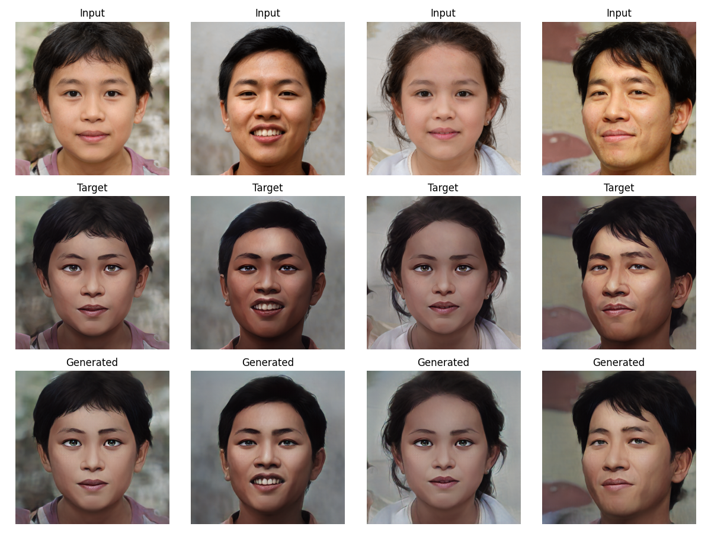

#### 项目说明
```text
     双城之战主角金克斯有句台词是“我有最美好的初衷”奈何却总是好心办了“坏事”。而
  希尔科最初因为与范德尔选择了不同的道路而决裂了，但到最后的时候希尔科却越来越像
  范德尔。希尔科最后对金克斯说的“你，我什么都不换”更是让无数玩家泪崩。
  出于对双城之战画风的喜爱，本项目将利用Pix2PixHD网络实现双城之战动画进行风格迁移。
```
#### 项目文件说明
<pre>
  trainHD.py                 ---模型训练入口<br>
  testHD.py                  ---模型测试入口<br>
  test_visual.py             ---可视化模型测试入口<br>
  p2phdconfigs.py            ---项目配置文件<br>
  pix2pixHDnetworks.py       ---模型网络<br>
  model_genrator.py          ---模型生成器<br>
  DataManager.py             ---数据处理模块<br>
  FID_evaluation.py          ---FID计算<br>  
  tool.py                    ---自定义辅助功能<br>
</pre>
<br>


#### 开发运行环境
1. PyTorch  2.0.0
2. Python  3.8(ubuntu20.04)
3. Cuda  11.8
4. CPU 16 vCPU Intel(R) Xeon(R) Platinum 8481C
5. RTX 4090D(24GB) * 1
6. 80GB

#### 模型运行说明
1. ``请确保你的环境可以满足配置需求, 显存>20G, 内存8G以上``
<br><br>
2. ``python trainHD.py 开始训练``
<br><br>
3. ``python testHD.py 开始测试``
<br><br>
4. ``python test_visual.py 启动可视化测试``
<br><br>
5. ``python FID_evaluation.py 启动FID计算``
`
### 效果展示


